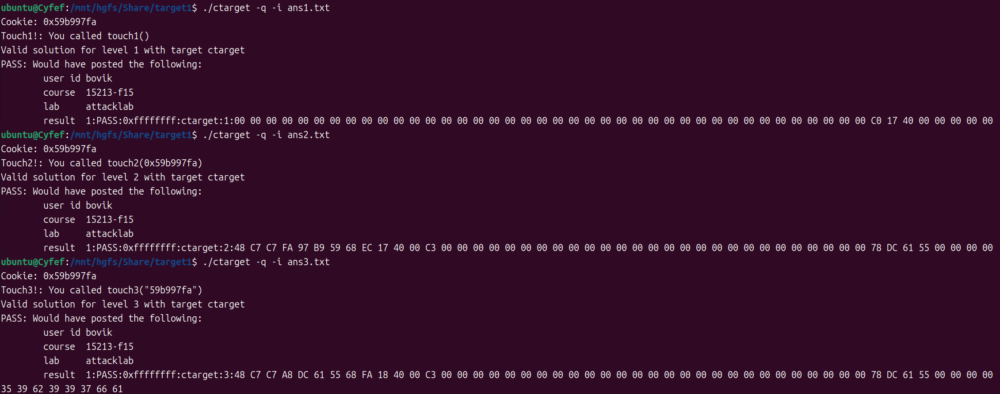
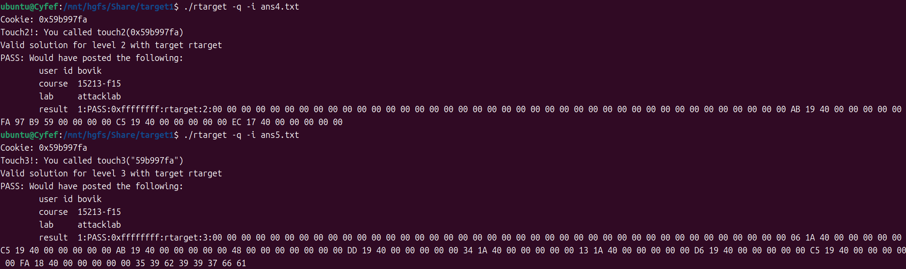

# Attacklab

------

- `ans?` 是每个阶段最终的读入
- `A?` 经过 `hex2raw` 转换为 `ans?` ，是输入的十六进制码
- `AS?` 是Phase ？对应的将汇编代码转换为机器码的过程

因为不需要发送信息到服务器，运行程序的命令要加 `-q`

一些想法和经验：

1.  最终输入到缓冲区的要是经过 `hex2raw` 转换的字符串
2. 特别注意小端序，一串数字会按照从高位到低位的顺序存入内存，读取内存中的数字会把低地址侧存储的自动变为高位
3. 读取内存中的字符串时，会按照从低地址到高地址的顺序依次读字符
4. Phase 5 可以利用提供的某些现成的函数，也要计算好存储cookie位置的偏移量

