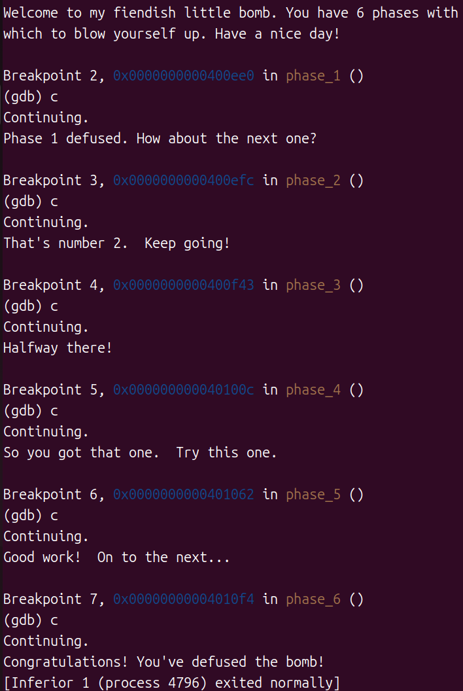

# Bomblab

------

设置.gdbinit每次自动初始化gdb

```bsh
touch .gdbinit

mkdir -p ~/.config/gdb

echo "set auto-load safe-path /" > ~/.config/gdb/gdbinit
```

.gdbinit:

```bash
et args psol.txt

b explode_bomb
command
return
end

b phase_1
b phase_2
b phase_3
b phase_4
b phase_5
b phase_6
```

1. 设置了psol.txt为自动输入
2. 在爆炸函数处设断点，并自动结束爆炸函数防止爆炸(这个bomb无发送信号的函数)
3. 在每个阶段开始设置断点

gdb命令:

```bash
gdb bomb   #进入gdb
layout asm   #汇编代码视图
layout regs   #寄存器状态试图
按下Ctrl+x 再按a   #关闭layout
run   #运行程序
b(break) 函数名/地址    #设置断点
c(continue)  #前进到下一个断点
si(stepi)   #执行一个指令
x/s 地址   #打印存在地址处的字符串
kill   #终止程序运行
quit   #退出gdb
```



一些想法和经验：

1. 注意传入函数的参数位置顺序：%rdi , %rsi , %rdx , %rcx , %r8 , %r9 , 栈帧从右往左。关注这些位置的内容变化
2. 画出栈帧可能有助于分析
3. `call`会自动减少%rsp，将返回的指令地址压入栈帧
4. 注意 `lea` 只计算地址，不访问内存