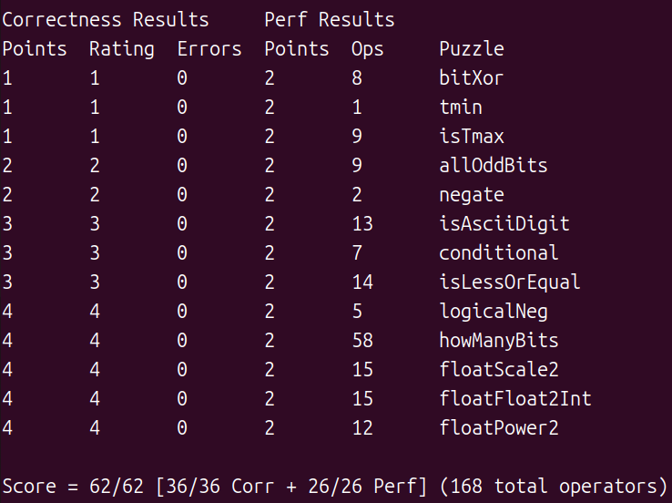

# Datalab

------

一些想法和经验：

1. `!(非0)=0` 和 `!0=1`，`!!(非0)=1` 和 `!!0=0` 可用于将0和非0转化为真假(1/0)，进而搭配 `&` 或 `|` 效果可等同于 `&&` 和 `||`
2. `>>31`取符号位注意int类型是算术右移，即负数右移取符号位得到-1(0xffffffff) , 正数得到0
3. `(bitXor)`单个位的位运算可以视为逻辑运算，多个位的按位运算同样可以视为逻辑运算，因为运算是单独发生在每个位上的。正因如此，不妨把x,y看作1-bit进行分析
4. `(isTmax)`利用好关系 $T_{max}+1=T_{min}$ 
5. `(allOddBits)`每8位分治，前一个8位若满足要求则依然得到170(0x10101010)，后续继续使用。若4个8位都满足要求，最后依旧得到170，判断最终是否为170即可
6. `(negate)`变相反数取反加1 经常用到
7. `(conditional)`将某种条件转化为掩码mask来表达
8. `(logicalNeg)`注意到0变为-0符号位不变，非0变为相反数符号位变化
9. `(howManyBits)`类似于二分查找的思想

10. *(float)*float类型注意几种情况分类讨论，编码部分分块处理
